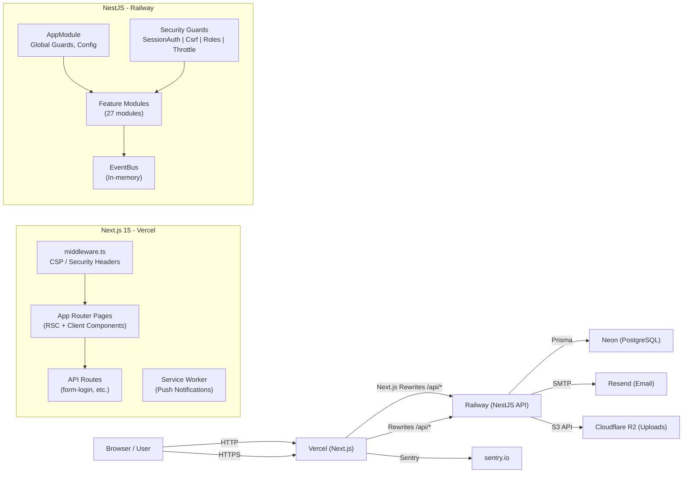
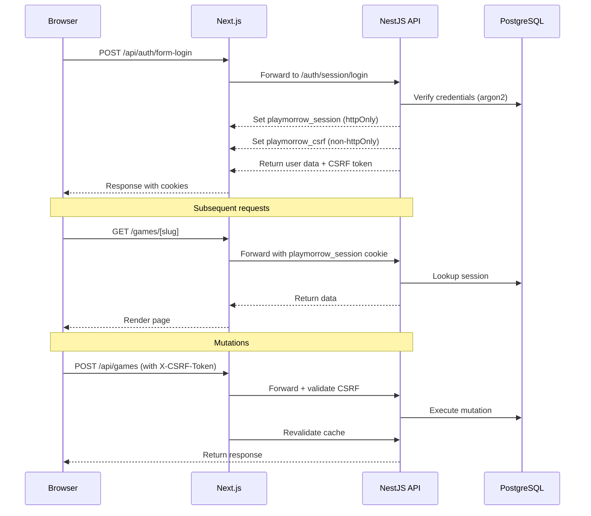
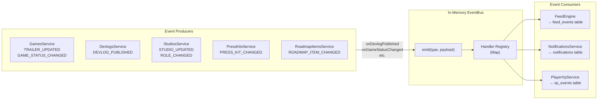
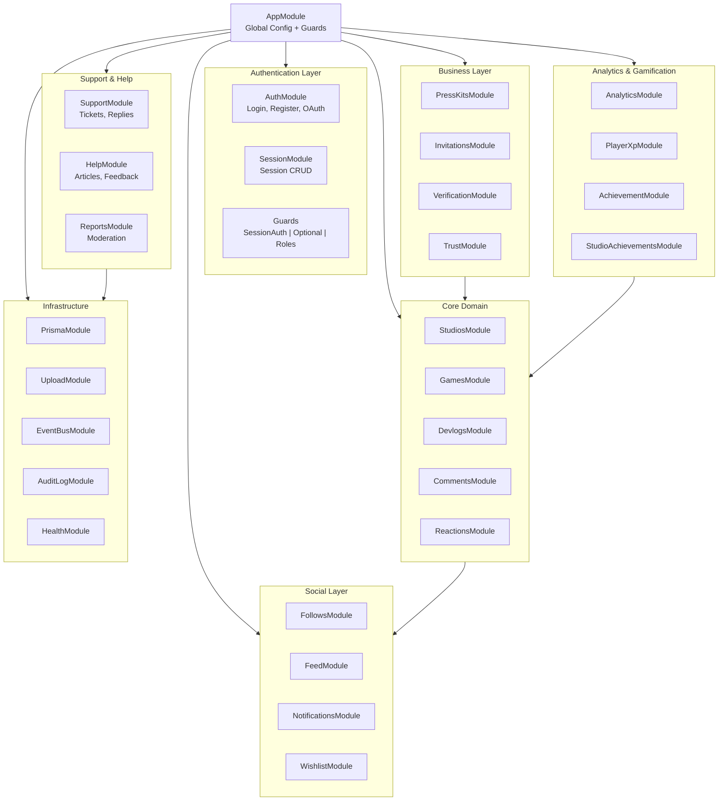
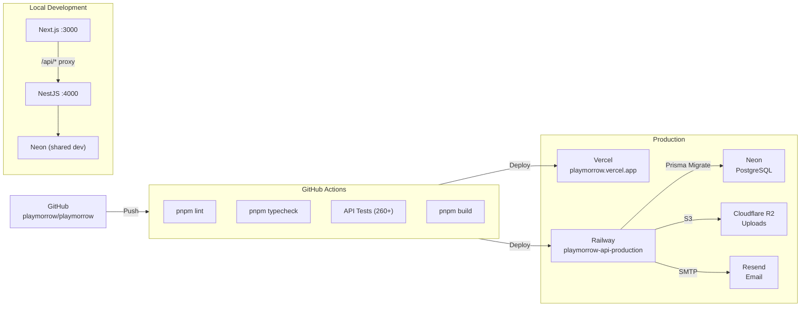

# Playmorrow Architecture

## Project Overview

Playmorrow is a social discovery platform for indie games. Indie studios showcase games, publish devlogs, maintain roadmaps, and build communities. Players discover games, follow studios, and participate in discussions.

The platform consists of a **Next.js 15** frontend (App Router) and a **NestJS** backend (REST API) communicating over HTTP, with a **PostgreSQL** database via **Prisma ORM**.

---

## Technology Stack

| Layer | Technology |
|---|---|
| Frontend | Next.js 15 (App Router), React 19, Tailwind CSS v4 |
| State | TanStack Query v5 (server state), React context (UI state) |
| Backend | NestJS 10, Express, TypeScript |
| Database | PostgreSQL 16 (Neon serverless), Prisma ORM 5 |
| Auth | Session-based (`playmorrow_session` cookie) + JWT |
| Cache | In-memory (NestJS), browser cache (Next.js) |
| Monitoring | Sentry, Pino structured logging, CSP reporting |
| Email | Resend API |
| Uploads | Local disk (dev) / S3-compatible (prod: R2) |
| CI/CD | GitHub Actions, Railway (API), Vercel (web) |

---

## Monorepo Structure

```
playmorrow/
├── apps/
│   ├── web/                  # Next.js 15 frontend
│   │   ├── app/              # App Router pages & API routes
│   │   ├── components/       # React components
│   │   ├── lib/              # Utilities, API client, hooks
│   │   ├── public/           # Static assets, service worker
│   │   ├── actions/          # Server actions (revalidation)
│   │   └── middleware.ts     # CSP, security headers
│   └── api/                  # NestJS backend
│       └── src/
│           ├── common/       # Shared guards, decorators, event bus
│           ├── auth/         # Auth modules, guards, strategies
│           ├── [feature]/    # Feature modules (games, studios, etc.)
│           └── main.ts       # Entry point (bootstrap)
├── packages/
│   └── database/             # Prisma schema, migrations, client
├── docs/                     # Documentation
├── turbo.json                # Turborepo configuration
└── package.json              # Root workspace config (pnpm)
```

---

## Architecture Flow



## Authentication Flow



## Event Bus Flow

> **Note:** The project has two event mechanisms. The in-memory `EventBus` (RxJS Subject) is used for runtime coordination (Goals, Notifications). The `FeedEngineService` handles feed-specific events and writes to the `feed_events` table. This duality is historical — both work correctly but the split should be consolidated in a future pass.



## Module Relationships



---

## Frontend Architecture

### Pages (App Router)

| Route | Type | Description |
|---|---|---|
| `/` | Client | Homepage with leaderboard, featured games, feed |
| `/games` | Client | Game catalogue with search |
| `/games/[slug]` | Client | Game detail (devlogs, roadmap, community) |
| `/studios` | Client | Studio directory |
| `/studios/[slug]` | Client | Studio profile |
| `/feed` | Client | Public dev feed |
| `/devlogs/[id]` | Client | Devlog detail (blog-style) |
| `/dashboard/*` | Client | User/studio dashboard |
| `/login` | Client | Login page |
| `/register` | Client | Registration page |
| `/search` | Client | Global search |
| `/users/[username]` | Client | User profile |
| `/support` | Client | Support center |
| `/help` | Client | Help center |
| `/privacy`, `/terms`, `/cookies`, `/community-guidelines` | Static | Legal pages |
| `/leaderboard` | Client | XP leaderboard |
| `/about`, `/contact` | Static | Info pages |

### Component Architecture

```
components/
├── ui/                  # Base UI primitives (Button, Input, Card, etc.)
├── site-header.tsx      # Global navigation
├── site-footer.tsx      # Global footer
├── md-editor.tsx        # Markdown editor (preview/split modes)
├── sanitized-markdown.tsx  # DOMPurify-rendered markdown
├── cookie-consent.tsx   # GDPR cookie consent banner
├── push-toggle.tsx      # Push notification subscription toggle
├── lightbox.tsx         # Screenshot lightbox (keyboard nav)
└── dashboard/           # Dashboard-specific components
    ├── shared.tsx       # DashboardPanel, SidebarLink (shared)
    ├── PlayerDashboard.tsx
    └── StudioDashboard.tsx
```

### State Management

- **Server state**: TanStack Query v5 with `useQuery`, `useMutation`, `useInfiniteQuery`
  - Cache keys follow `['resource', ...params]` convention
  - Auto-refresh at 30s intervals on pages that need real-time updates (feed, notifications, game stats)
  - Optimistic updates for like/reaction mutations
  - Cache revalidation via server actions (`/actions/revalidate.ts`)
- **Client state**: React `useState` / `useReducer` for UI state
- **Global UI state**: Lightbox context (screenshot viewer)
- **No Redux/Zustand**: TanStack Query + React state covers all needs

### API Client

`lib/api/client.ts` provides:
- Typed `api.get<T>()`, `api.post<T>()`, etc. with automatic CSRF token injection
- `ApiError` class for error handling
- Paginated response types
- All DTO types for frontend usage

`lib/api/hooks.ts` provides:
- Type-safe TanStack Query hooks per resource
- Infinite scroll helper (`useIntersectionObserver`)

---

## Backend Architecture

### Module Organization (41 Modules)

| Module | Purpose |
|---|---|
| `AuthModule` | Login, register, OAuth, JWT, session auth |
| `UsersModule` | User CRUD, profile management |
| `StudiosModule` | Studio CRUD, membership management |
| `GamesModule` | Game CRUD, stats |
| `DevlogsModule` | Devlog CRUD, scheduled publishing, screenshots |
| `CommentsModule` | Comments + replies with nested tree support |
| `ReactionsModule` | Devlog reactions (like/love/hype/insightful) |
| `FollowsModule` | Follow/unfollow studios and games |
| `FeedModule` | Public + personal feed generation (FeedEngine) |
| `RoadmapItemsModule` | Roadmap CRUD with ordering |
| `PressKitsModule` | Press kit management |
| `NotificationsModule` | In-app notifications + SSE push |
| `PushNotificationsModule` | Web push notification subscriptions |
| `UploadModule` | File upload with validation (local + S3/R2) |
| `SearchModule` | Global search across games, studios, users |
| `WishlistModule` | Game wishlisting |
| `InvitationsModule` | Studio member invitations |
| `ReportsModule` | Content moderation reports |
| `AnalyticsModule` | Game + studio analytics |
| `PlayerXpModule` | XP/leveling system |
| `AchievementModule` | Player achievements |
| `StudioAchievementsModule` | Studio achievements |
| `HealthModule` | Health checks |
| `StudioHealthModule` | Studio health scores |
| `SupportModule` | Support ticket system |
| `HelpModule` | Help center articles + feedback |
| `VerificationModule` | Studio verification workflow |
| `TrustModule` | Studio trust scoring |
| `AuditLogModule` | Auditing sensitive operations |
| `EventBusModule` | In-memory event bus (ephemeral — events lost on restart; SSE clients must reconnect) |
| `GoalsModule` | Studio goal tracking |
| `WeeklyReportsModule` | Automated weekly studio reports |
| `StudioChatModule` | Studio internal chat |
| `StudioProfileModule` | Extended studio company profiles |
| `StudioPressKitModule` | Studio-level press kits |
| `MarketplaceModule` | Game asset marketplace listings, catalog, purchases |
| `PaymentsModule` | Stripe Connect Express, PaymentIntent, webhook processing |
| `PublisherModule` | Revenue dashboard per studio |
| `CreatorModule` | Referral codes + commission tracking |
| `PartnerModule` | B2B CRM (6 partner types: University, Publisher, etc.) |
| `EventsModule` | Events listing, detail, ticketing, upcoming filter |

### Global Guards (registered in AppModule)

1. **OptionalSessionGuard** (first in chain): Attaches user to request if valid session cookie present; does not block unauthenticated requests.
2. **CustomThrottlerGuard**: Per-user or per-IP rate limiting (60 req/min base). Storage is Redis-backed (`apps/api/src/common/redis-throttler.storage.ts` — atomic Lua `INCR`/`PEXPIRE`/`PTTL` against Upstash) with a fail-open in-memory fallback if Redis is unreachable.
3. **CsrfGuard**: Blocks authenticated mutations without valid `X-CSRF-Token`.

### Security Decorators

- `@SessionAuth()` — require valid session
- `@Roles('ADMIN')` — require global role
- `@CurrentUser()` — inject authenticated user
- `@SkipThrottle()` — bypass rate limiting

---

## Database (PostgreSQL + Prisma)

### Key Models

| Model | Description |
|---|---|
| `User` | Account, auth, profile, preferences, XP/level |
| `Studio` | Studio profile, verification, trust score, XP/level |
| `StudioMember` | User-studio membership with `StudioRole` |
| `Game` | Game profile, status, stats |
| `Devlog` | Blog-style updates with screenshots, tags, scheduling |
| `Comment` | Game community posts + replies (`POST` vs `REPLY` discriminator) |
| `Reaction` | Devlog reactions with `ReactionType` |
| `FeedEvent` | Activity feed entries (devlogs, roadmap, status changes) |
| `Notification` | In-app notifications |
| `Follow` | User follows on studios/games |
| `RoadmapItem` | Roadmap entries with status + ordering |
| `Session` | Server-side session records |
| `AuditLog` | Sensitive operation audit trail |
| `SupportTicket` | Support requests with replies and history |
| `HelpArticle` | Help center articles with categories + feedback |

### Schema Design Principles

- **Enum-driven**: `StudioRole`, `UserRole`, `GameStatus`, `ReactionType`, etc. defined at schema level.
- **Cascading deletes**: Studio deletion cascades to games, devlogs, members.
- **Denormalized counters**: `followersCount`, `gamesCount` on Studio/Game for fast reads.
- **Indexed queries**: Foreign key indexes on all relations; composite indexes on common query patterns.
- **Migrations**: All schema changes via Prisma migrations (not `db push` in production).

---

## API Design

- **Base URL**: `/api` (Next.js rewrites to NestJS)
- **Auth endpoints**: `/api/auth/*`
- **RESTful resources**: `/api/games`, `/api/studios`, `/api/devlogs`, etc.
- **Personal endpoints**: `/api/me/*` for authenticated user's own resources
- **Pagination**: `?page=1&pageSize=20` — response includes `hasMore`, `total`
- **Error format**: Structured JSON with status code, message
- **OpenAPI/Swagger**: Available at `/docs` in development only

---

## Notification System

- **In-app notifications**: Stored in `notifications` table, fetched via API
- **SSE (Server-Sent Events)**: Real-time push to browser for new notifications
- **Web push**: Service worker push notifications via `PushSubscription` model
- **Auto-refresh**: TanStack Query `refetchInterval: 30000` on notification dropdown
- **Mark-all-read**: Bulk notification dismissal endpoint
- **Welcome bot**: New users receive a system-generated welcome notification

---

## File Upload System

- **Storage backends**: Local disk (development) or S3/R2 (production) via `REDACTED_STORAGE_PROVIDER` env var
- **Validation chain**: MIME type check → magic byte verification → dimension check (≤4096px) → size limit (5MB request cap)
- **Endpoint**: `POST /api/upload` → returns `{ url, filename, size, mimeType }`
- **Serving**: Local files served via `express.static` at `/api/uploads/*`
- **Rate limit**: 20 uploads per minute

---

## Support System

- **Support tickets**: Users open tickets; staff assign and reply
- **History tracking**: `SupportTicketHistory` logs all status changes
- **File attachments**: Upload module integrated
- **Admin UI**: Separate admin controller for staff ticket management

---

## Help Center

- **Categorized articles**: `HelpCategory` → `HelpArticle` hierarchy
- **User feedback**: `HelpArticleFeedback` with helpful/unhelpful ratings
- **Seed data**: Admin script populates initial articles
- **Public read**: All articles publicly accessible; admin write for content management

---

## Studio Verification

- **Verification levels**: `UNVERIFIED` → `EMAIL_VERIFIED` → `BASIC_VERIFIED` → `OFFICIAL_STUDIO` → `PARTNER_STUDIO` → `FEATURED_STUDIO`
- **Request workflow**: Studio submits verification request → admin reviews → approve/reject/request more info
- **Document uploads**: Supporting documents stored as JSON
- **Admin review**: Dedicated admin controller with pending requests listing

---

## Analytics Pipeline

- **Game analytics**: Views, followers, wishlists, comment counts over time
- **Studio analytics**: Aggregate stats across all games
- **Data source**: Direct Prisma queries on production tables (denormalized counters)
- **Endpoints**: `/api/analytics/game/:id`, `/api/analytics/studio/:id`
- **No external analytics service**: Plausible for page analytics; custom counters for game/studio data

---

## Deployment Architecture



### Environments

| Environment | Frontend | Backend | Database | Purpose |
|---|---|---|---|---|
| Local | `:3000` | `:4000` | Neon dev | Development |
| Production | Vercel | Railway | Neon prod | Live |

### Environment Variables

Required in production (server fails fast if missing):
- `DATABASE_URL`, `JWT_SECRET`, `SESSION_SECRET`, `CSRF_SECRET`, `RESEND_API_KEY`, `WEB_ORIGIN`

Recommended:
- `COOKIE_DOMAIN`, `SENTRY_DSN`, `NODE_ENV`

---

## Performance Considerations

- **TanStack Query caching**: Automatic cache management with stale-while-revalidate
- **30s auto-refresh**: Feed, game stats, roadmap, notifications
- **Optimistic updates**: Like/reaction mutations update UI instantly
- **Infinite scroll**: Intersection Observer for paginated lists
- **SSR + RSC**: Static pages use React Server Components; interactive pages opt into client components
- **Image optimization**: Next.js `next/image` with AVIF/WebP formats
- **No N+1 queries**: Verified clean during professionalization audit
- **Pagination**: All list endpoints paginated client and server side
- **Compression**: Enabled at infrastructure level (Vercel/Railway)
- **Pre-server**: NestJS boots a lightweight HTTP health server before full app initialization to satisfy Railway's deploy health check timeout

## Security Architecture

See [SECURITY.md](./SECURITY.md) for detailed security documentation. Overview:

1. **Auth**: Session-based (`playmorrow_session` httpOnly cookie) + JWT
2. **CSRF**: Stateless HMAC-SHA256, global `CsrfGuard`, `X-CSRF-Token` header
3. **CSP**: Nonce-based (frontend) + helmet middleware (backend)
4. **Rate limiting**: Per-user/IP via `CustomThrottlerGuard`
5. **Input validation**: class-validator with whitelist + forbidNonWhitelisted
6. **XSS**: DOMPurify + server-side sanitizeHtml
7. **Uploads**: MIME + magic byte + dimension + size validation
8. **Passwords**: argon2 hashing
9. **RBAC**: StudioRoles + GlobalRoles + service-layer enforcement
10. **Audit**: Structured logging + AuditLog model
