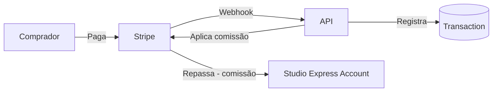

# Payments Architecture

## Stack

- **Processor:** Stripe (test mode first, production after verified)
- **Account model:** Stripe Connect Express (estúdios vendedores têm Express accounts)
- **Idempotência:** Tabela `processed_webhook_events` no Postgres (UNIQUE em `stripeEventId`)
- **Transações:** Model `Transaction` no Prisma — toda mudança de dinheiro é registrada

## Stripe Connect — Express Accounts

## Modelos

### Transaction
Toda transação financeira. Imutável — reembolsos criam nova transação `REFUND` referenciando a original.

### ProcessedWebhookEvent
Garante idempotência — INSERT com `ON CONFLICT DO NOTHING` antes de processar qualquer webhook.

## Comissão da Plataforma

Definida via `PLATFORM_FEE_PERCENT` (environment variable). Valor default: 10 (10%).

## Fluxo de Compra

1. Comprador faz checkout → frontend cria PaymentIntent via API
2. API chama Stripe com `application_fee_amount` (comissão)
3. Stripe confirma pagamento → envia `payment_intent.succeeded` webhook
4. API recebe webhook → registra `ProcessedWebhookEvent` (idempotência) → cria `Transaction` → cria `PurchasedLicense`
5. Comprador ganha acesso ao conteúdo

## Segurança

- Cartão nunca toca o backend (Stripe Elements)
- Chave Stripe secret em env var (`STRIPE_SECRET_KEY`)
- Chave Stripe webhook signing secret em env var (`STRIPE_WEBHOOK_SECRET`)
- Webhook validado via `stripe.webhooks.constructEvent()` (assinatura)
